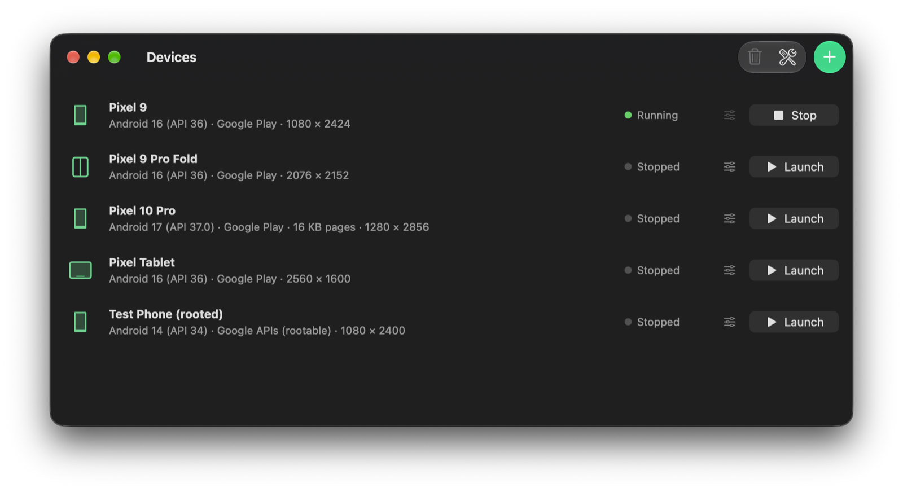
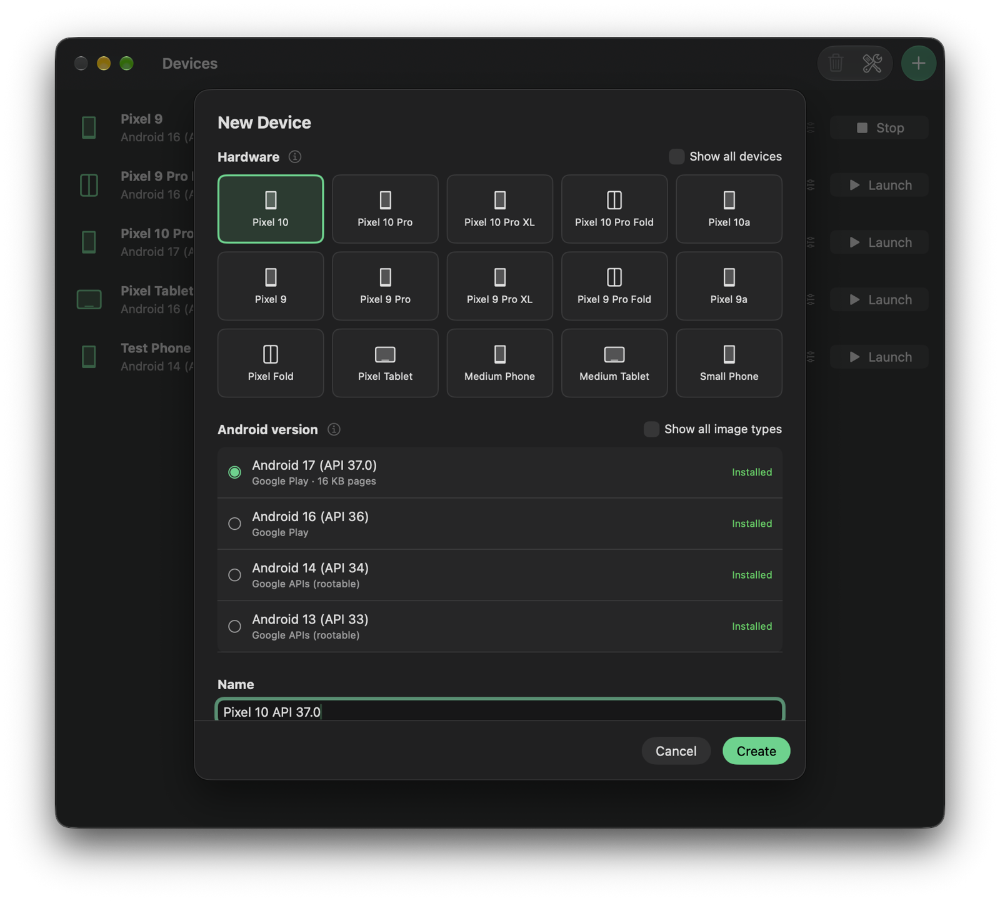
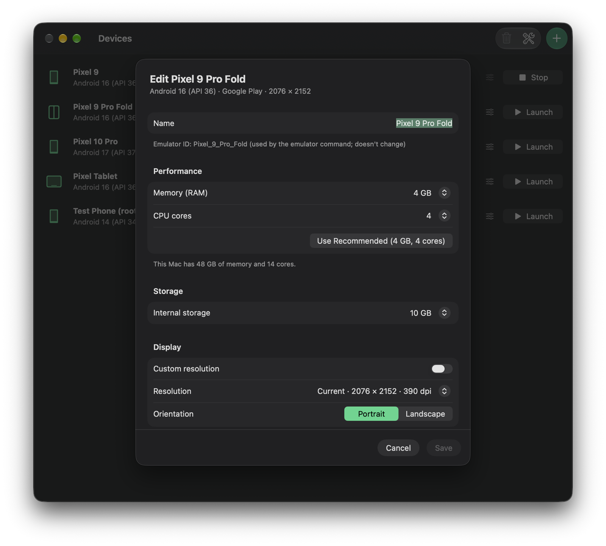
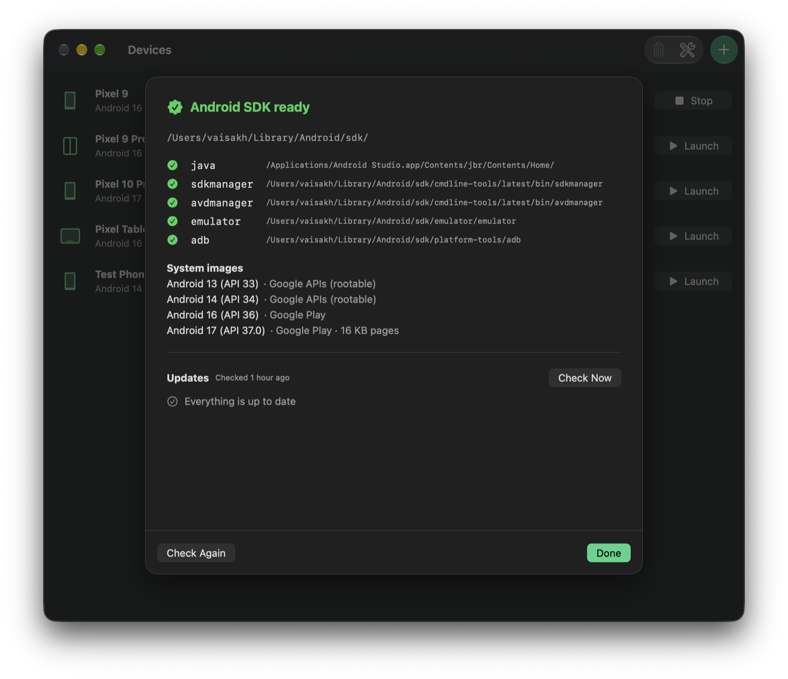

<div align="center">

# EmuDock

**Android emulators, zero setup.**

A native macOS app that installs the Android SDK and creates, launches and manages
Android emulators without Android Studio.




</div>

---

## Why

Running an Android emulator on a Mac normally means installing a 3 GB IDE, finding the
right Java version, accepting licenses on the command line, and picking from dozens of
confusing system images. That's a lot if you're a React Native, Flutter or web developer,
a QA tester or a designer who just needs a phone on the screen.

EmuDock does it in one click, and then gets out of the way.

## Features

**One-click setup.** EmuDock checks what's already on your Mac and installs only what's
missing: a Java runtime, Google's command-line tools, the emulator, `adb` and the newest
Android image for your chip. Every download is verified with a checksum. If you already
use Android Studio, EmuDock reuses its SDK and Java.

**Your emulators at a glance.** See every emulator with its Android version, screen size
and live status (*Starting…*, *Running*, *Stopped*). Launch, cold boot or stop with one
click. Emulators started from Android Studio or the terminal show up too.

**New devices in seconds.** Pick a phone, foldable or tablet (the newest Pixels are on
top), pick an Android version, and create. Versions you don't have yet download
automatically. New emulators get sensible defaults (4 GB RAM, 4 CPU cores, Mac keyboard
input) instead of Google's 1-core default.



**Edit without digging through config files.** Change RAM, CPU cores, storage, resolution,
orientation, cameras and boot mode from a simple form. Limits are based on your Mac's
actual memory and cores.



**Keep the SDK up to date.** See exactly which tools and Android versions are installed.
EmuDock checks for updates once a day and shows a badge when the emulator, platform tools
or command-line tools have a new version.



**From the menu bar.** Launch, cold boot or stop any emulator from the menu bar without
opening the window.

**And the small things:** rename, delete several emulators at once, show an emulator or
its `config.ini` in Finder, and ⓘ explanations for the confusing parts.

## Install

> **Coming soon:** signed and notarized builds via Homebrew:
>
> ```sh
> brew install --cask vaisakh678/tap/emudock
> ```

Until then, you can [build from source](#build-from-source).

### Requirements

- macOS 15 Sequoia or later, on Apple Silicon or Intel
- About 3 GB of free space for the Android SDK and one Android image
- An internet connection for the first setup and for downloading Android versions

## How it works

EmuDock doesn't bundle or modify Android. It's a friendly front end for Google's own tools:

| Task | Tool EmuDock runs |
|---|---|
| Install SDK packages and Android images | `sdkmanager` |
| Create, delete and list emulators and hardware profiles | `avdmanager` |
| Launch emulators | `emulator` |
| Check boot status, stop emulators | `adb` |

Everything goes where Android Studio would put it:

| What | Where |
|---|---|
| Android SDK | `~/Library/Android/sdk` (or `ANDROID_HOME`) |
| Emulators | `~/.android/avd` |
| Java runtime (only if EmuDock installed it) | `~/Library/Application Support/EmuDock/jre` |
| Emulator logs | `~/Library/Logs/EmuDock` |

So EmuDock and Android Studio can be used side by side, and uninstalling EmuDock leaves
your SDK and emulators untouched.

## FAQ

**Do I need Android Studio?**
No. EmuDock installs everything the emulator needs. If you already have Android Studio,
EmuDock reuses its SDK and Java instead of downloading them again.

**Why isn't it on the Mac App Store?**
App Store apps are sandboxed and can't run other programs such as `sdkmanager` and
`emulator`, which EmuDock depends on. It's distributed as a Developer ID–signed,
notarized app instead.

**Can I test Bluetooth or other hardware features?**
The Android emulator can't use your Mac's Bluetooth, so anything Bluetooth-related still
needs a physical Android phone.

**Why does changing storage erase the emulator's data?**
The emulator only sizes its data disk when it creates it. To apply a new size, EmuDock
removes the old disk and Android starts fresh, like a factory reset. EmuDock always asks
before doing this.

## Build from source

You'll need Xcode 26+ and [XcodeGen](https://github.com/yonaskolb/XcodeGen)
(`brew install xcodegen`).

```sh
git clone https://github.com/vaisakh678/emudock.git
cd emudock/macos
xcodegen generate
open EmuDock.xcodeproj
```

Run the tests with:

```sh
xcodebuild -project EmuDock.xcodeproj -scheme EmuDock -destination 'platform=macOS' test
```

Release builds are signed and notarized with `scripts/release.sh <version>`; see the
comments at the top of the script for the one-time setup.

### Project layout

```
macos/
├── project.yml        XcodeGen project definition
├── Sources/
│   ├── App/           App entry point and app-wide models (devices, SDK status, updates)
│   ├── Features/      Screens: setup, devices, new device, edit, SDK info
│   └── Services/      Wrappers around sdkmanager, avdmanager, emulator, adb and downloads
└── Tests/             Unit tests (Swift Testing)
scripts/
└── release.sh         Build, sign, notarize and zip a release
```

## Roadmap

- [ ] Signed releases on Homebrew
- [ ] Automatic app updates
- [ ] Choose a custom SDK folder
- [ ] Wipe data, and drag and drop an APK to install it
- [ ] Windows version

## Contributing

Issues and pull requests are welcome. For anything bigger than a small fix, please open
an issue first so we can talk it through.
